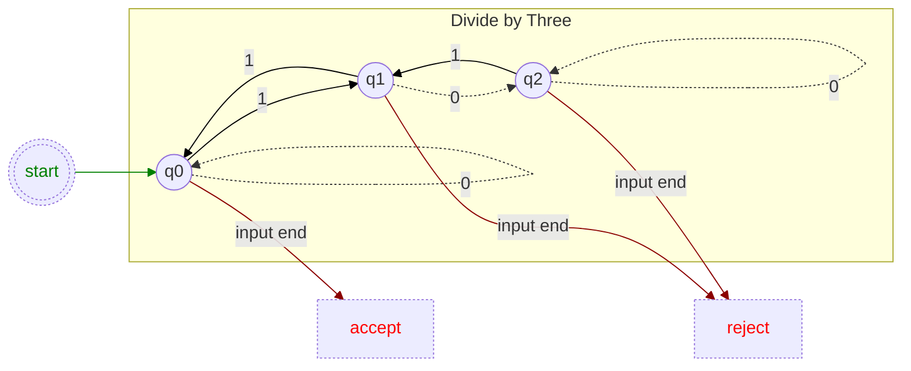

## State Graph Representations in x86

We begin with a trivial state graph which tracks the remainder of a number divided by three. Bits of an arbitrarily long number are examined from the most significant bit to bit zero. When no more bits remain the final state resolves if the number is an exact multiple of three.

Next a basic translation to x86 code which literal duplicates each `q*` node in the graph.
Function: Is a ECX bit [number] an exact multiple of three?
```asm
	jrcxz	invalid
q0:
	dec	ecx
	js	accept ; CF=0/1,
	bt	[number], ecx
	jnc	q0
q1:
	dec	ecx
	js	reject1
	bt	[number], ecx
	jc	q0
q2:
	dec	ecx
	js	reject0
	bt	[number], ecx
	jc	q1
	jmp	q2
accept:
	clc
reject1:
	cmc
reject0:
```
...carry flag set when number is exact multiple of three.


Noticing the repetitive assembly, we can more generally represent the state machine as a transition table.
```asm
	mov eax, 0xFF
	xor edx, edx ; clear sign flag to signal error
	jrcxz no_bits
	jmp entry
more:
	bt [number], ecx
	setc al
	movzx edx, [transitions + rdx + rax]
entry:
	dec ecx
	jns more
	mov al, [transitions + rdx + 2]
no_bits:
; SF=0, error
; SF=1, AL is result of state machine
```
A table of bytes is sufficient to represent the small number of states in this graph:
```asm
transitions db \;	0	1	end-of-input	this-state
			q0,	q1,	accept,\	; q0
			q2,	q0,	reject,\	; q1
			q2,	q1,	reject		; q2
```
States are defined by their offset within the table:
```asm
q0 := 3 * 0
q1 := 3 * 1
q2 := 3 * 2
```
Return values must be specified for end of input in each state.
```asm
accept := 1
reject := 0
```
The default return value is `0xFF` - when no bits are present - not a number.


## Further Discovery:

<details><summary>What is the upper-limit on the number of states which can be represented in a byte granular transition table?</summary>

No uppper limit exist as states can be represented by multiple tables.

</details>
<details><summary>Give a code example of your above ideas.</summary>

```asm
; some code here
```

</details>
<details><summary>How could early termination be handled for other types of graphs? ... or multiple invalid termination states?</summary>

Both of these can be accomplished with additional data within each state, and another termination branch within the inner loop.

</details>
<details><summary>If only the bit indices of the set bits can be used, write an algorithm to determine if the number is divisible by three.</summary>

```asm
; some code here
```

</details>
