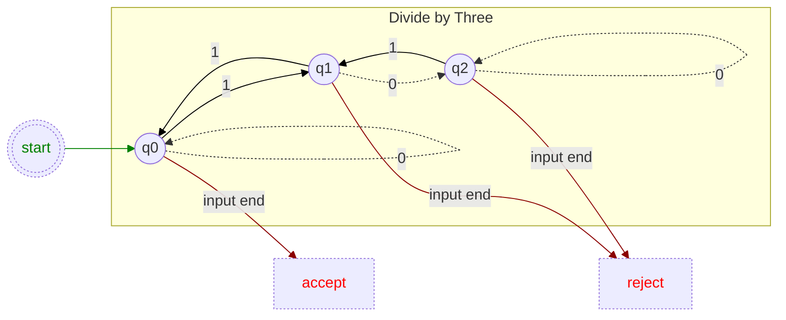

## State Graph Representations in x86

We start with a simple state graph that monitors the remainder of a number when divided by three. We examine the bits of a number of any length, starting from the most significant bit down to the least significant bit. Once all bits have been examined, the final state determines whether the number is a multiple of three.

Next, we translate this into basic x86 code, which essentially replicates each q* node in the graph. The function: Does the ECX bit [number] represent a multiple of three?
```asm
	jrcxz	invalid
q0:
	dec	ecx
	js	accept ; CF=0/1,
	bt	[number], ecx
	jnc	q0
q1:
	dec	ecx
	js	reject1
	bt	[number], ecx
	jc	q0
q2:
	dec	ecx
	js	reject0
	bt	[number], ecx
	jc	q1
	jmp	q2
accept:
	clc
reject1:
	cmc
reject0:
```
...carry flag set when number is exact multiple of three.


Observing the repetitive assembly, we can represent the state machine more generally as a transition table.
```asm
	mov eax, 0xFF
	xor edx, edx ; clear sign flag to signal error
	jrcxz no_bits
	jmp entry
more:
	bt [number], ecx
	setc al
	movzx edx, [transitions + rdx + rax]
entry:
	dec ecx
	jns more
	mov al, [transitions + rdx + 2]
no_bits:
; SF=0, error
; SF=1, AL is result of state machine
```
A byte table is adequate to represent the limited number of states in this graph:
```asm
transitions db \;	0	1	end-of-input	this-state
			q0,	q1,	accept,\	; q0
			q2,	q0,	reject,\	; q1
			q2,	q1,	reject		; q2
```
States are identified by their position within the table:
```asm
q0 := 3 * 0
q1 := 3 * 1
q2 := 3 * 2
```
We need to specify return values for each state when no more input is available.
```asm
accept := 1
reject := 0
```
The default return value is 0xFF, which signifies that no bits are present - hence, not a number.


## Further Discovery:

<details><summary>What is the maximum number of states that can be represented in a byte-based transition table?</summary><b>

> No uppper limit exist as states can be represented by multiple tables.

</b></details>
<details><summary>Give a code example of your above ideas.</summary><b>

```asm
; some code here
```

</b></details>
<details><summary>How could we manage early termination for other types of graphs? Or handle multiple invalid termination states?</summary><b>

> Both of these can be accomplished with additional data within each state, and another termination branch within the inner loop.

</b></details>
<details><summary>If we can only use the bit indices of the set bits, write an algorithm to determine if the number is divisible by three.</summary><b>

```asm
	xor eax, eax
	; only test bit zero of number's bit indices
@@:	bt dword [rsi + rcx*8 - 8], 0
	; all `2^n MOD 3` values result in {1,2} based on parity of index
	adc eax, 1
	loop @B
	mov ecx, 3
	xor edx, edx
	div ecx
	; return zero flag if exact multiple of three
	test edx, edx
```

</b></details>
